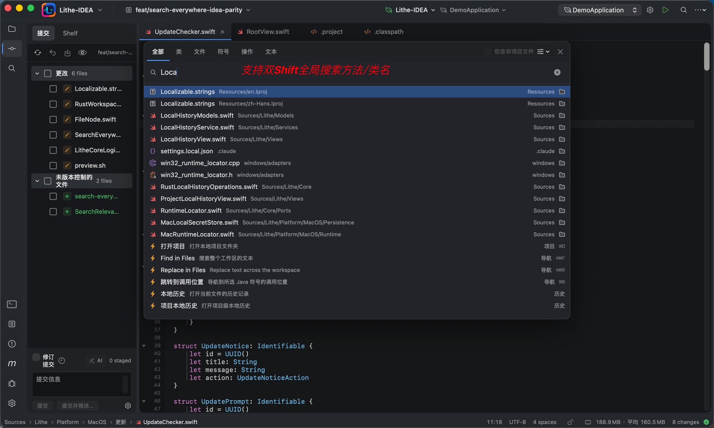
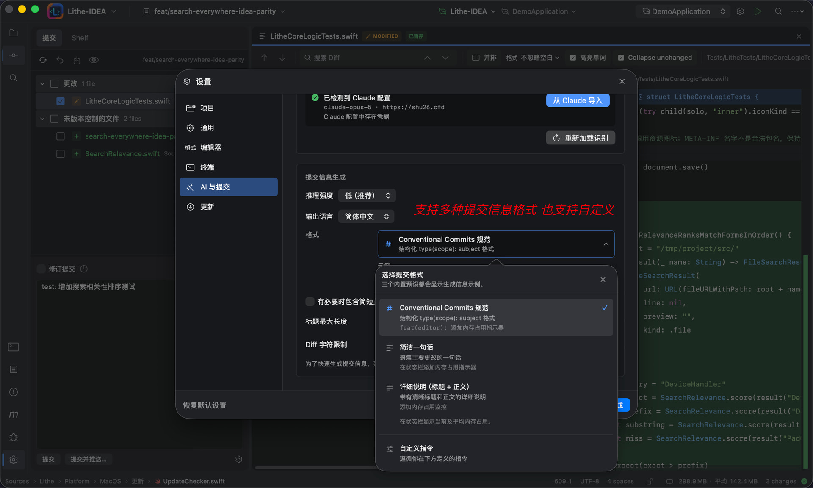
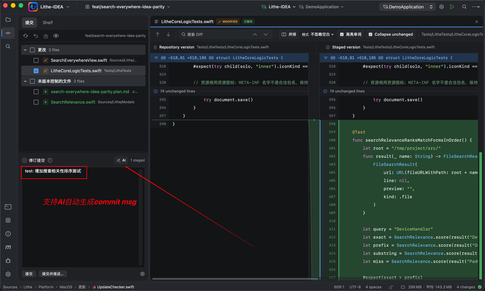
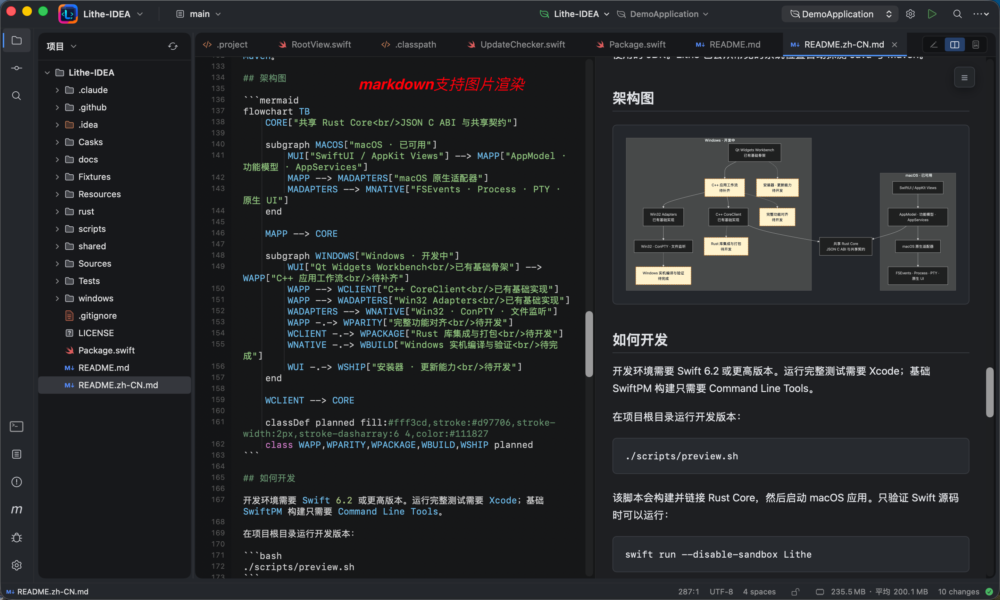
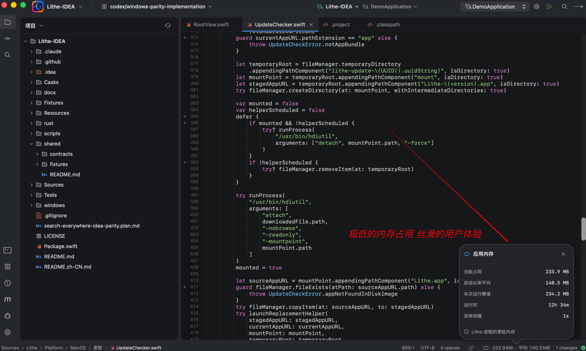
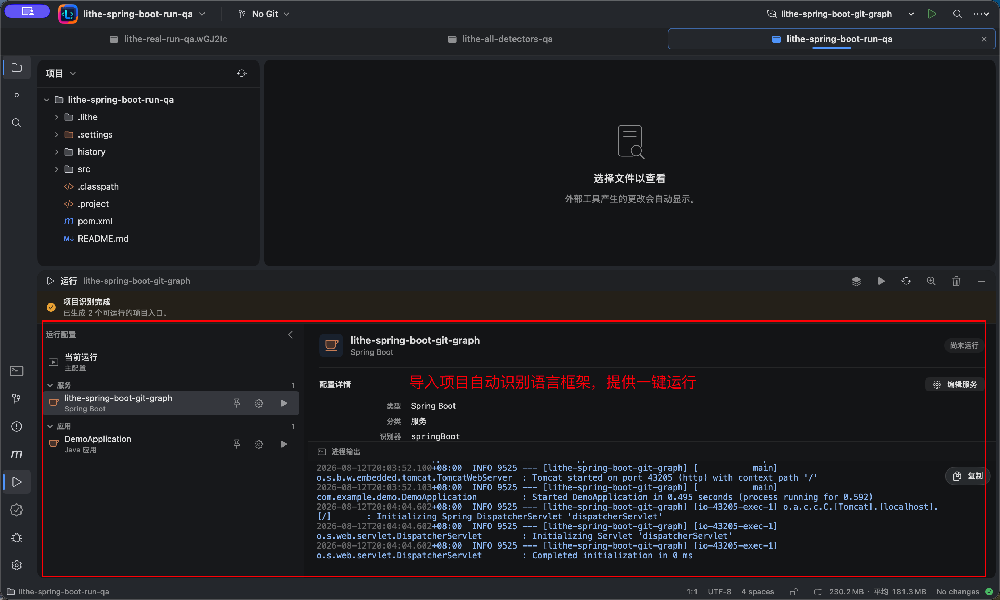
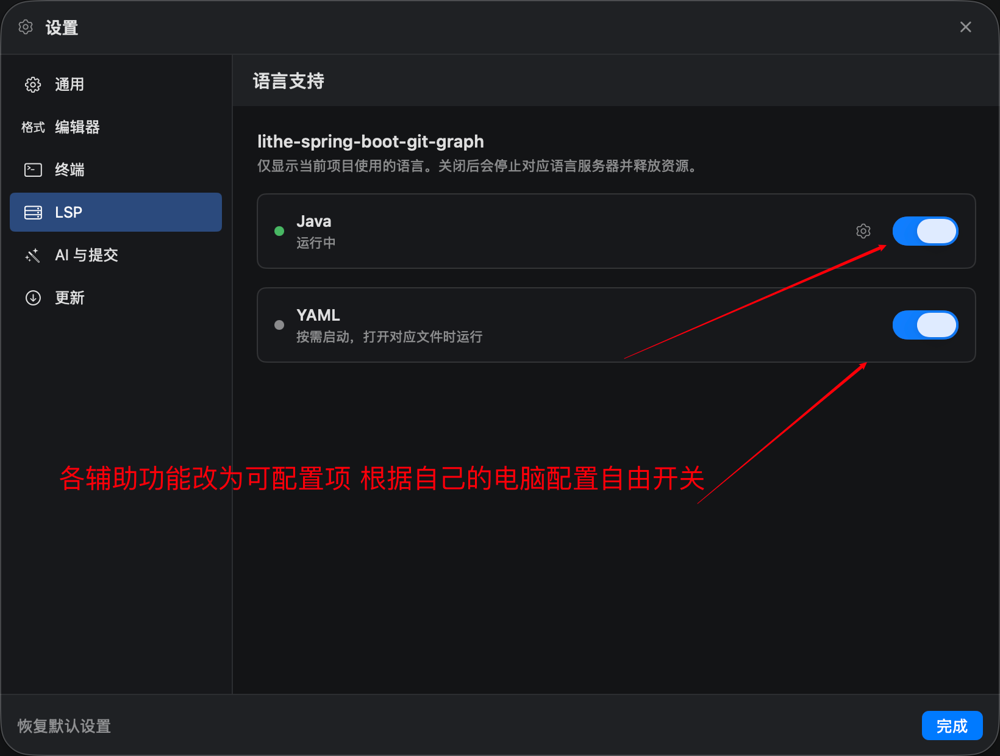
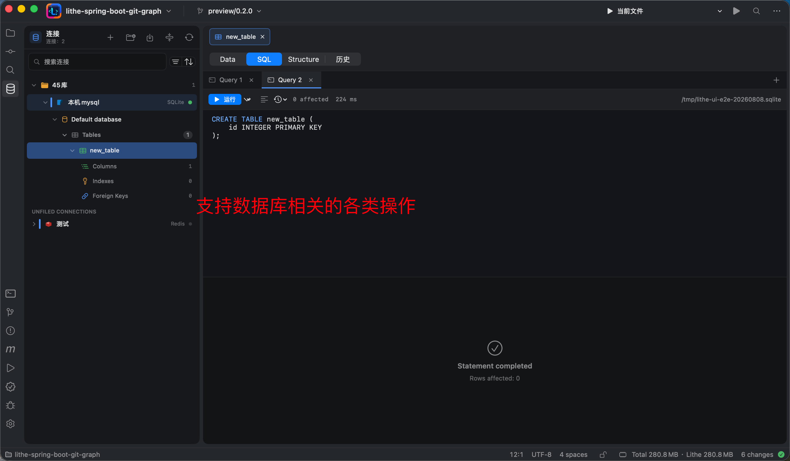
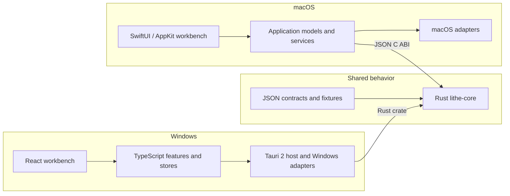

> **Fork Notice:** This project is forked from [Lithe-IDEA](https://github.com/1lck/Lithe-IDEA) by [1lck](https://github.com/1lck), licensed under the [Apache License 2.0](./LICENSE). Light Idea is an independent distribution based on that codebase.

<div align="center">
  

  <h1>Light Idea</h1>

  <p><strong>A low-memory IntelliJ IDEA alternative for Java development and AI collaboration</strong></p>

  <p>
    <a href="#core-features">Core features</a> ·
    <a href="#product-tour">Product tour</a> ·
    <a href="#download-and-install">Download</a> ·
    <a href="https://1lck.github.io/Lithe-IDEA/">Decision board</a> ·
    <a href="#develop-lithe">Develop Light Idea</a>
  </p>

  <p>
    <a href="https://hellogithub.com/repository/1lck/Lithe-IDEA" target="_blank"></a>
  </p>

  <p>
    <a href="https://github.com/1lck/Lithe-IDEA/releases/latest"></a>
    <a href="https://github.com/1lck/Lithe-IDEA/releases"></a>
    
    
    
    <a href="#download-and-install"></a>
  </p>
</div>

## Why Light Idea

Codex, Claude Code, and other AI coding tools can now handle much of the implementation work. Developers still need an IDE to understand the generated code, follow symbols, run and debug the project, and review every diff. Keeping a heavyweight development environment open for those tasks can mean several gigabytes of resident memory.

## Meet Light Idea

Light Idea is a lightweight IntelliJ IDEA alternative built first for Java and Spring Boot developers. It keeps the core workflows for browsing, editing, navigation, search, Maven, run and debug, Git diff review, local history, and databases.

The Light Idea application typically uses about **300–400 MB of baseline memory** after opening a regular project. Language servers, terminals, build tools, debuggers, and database helpers start on demand. Actual usage varies with the project and active services.

> **AI writes the code. Light Idea helps you understand it, run it, and review it.**

## If macOS says it cannot open `Light Idea.app`

If macOS says that Apple cannot verify whether `Light Idea.app` contains malware, the manually downloaded package may not yet be notarized by Apple. First confirm that the app came from the trusted [GitHub Releases](https://github.com/1lck/Lithe-IDEA/releases/latest), then use one of these methods:

1. In **Applications**, Control-click `Light Idea.app`, choose **Open**, and choose **Open** again in the confirmation dialog.
2. If macOS still blocks it, open **System Settings > Privacy & Security**, click **Open Anyway** next to the security warning, and launch the app again.
3. You can also remove the quarantine attribute in Terminal:

   ```bash
   sudo xattr -dr com.apple.quarantine "/Applications/Light Idea.app"
   ```

Only use these steps for an app whose source you trust. Homebrew installations usually do not require manual quarantine removal.

## Core features

<details>
<summary>Expand core features</summary>

1. Built for Spring Boot projects and Java development.
2. Maven management, breakpoint debugging, and custom run configurations.
3. Git management and side-by-side diff review.
4. Double-Shift search and `Command + Shift + F` project-wide search.
5. Process-free lightweight completion and current-file navigation, with on-demand language servers for richer completion, hover, and semantic navigation.
6. Local snapshot history.
7. Multiple projects open within the app.
8. Multiple files open independently in the same window.
9. AI-generated commit messages with customizable formats.
10. Rich Markdown rendering consistent with Yuque syntax.
11. Local application memory usage monitoring.
12. One-command installation and updates through Homebrew.
13. One-click in-app updates and installation.
14. Automatic project entry-point detection with one-click run support for Spring Boot, Java, Maven, Gradle, npm, Cargo, Go, Python, Make, Docker Compose, Procfile, and shell projects.
15. Per-language service switches so language servers can be enabled or disabled independently to match the machine's resources.
16. Multi-line editor tabs for keeping more files visible in the same workspace.
17. Database connection workspace with multiple database types, connection management, SQL history, table browsing, and database operations.
18. Ongoing bug fixes and user experience improvements.

</details>

## Product tour

<p align="center">
  
  
</p>

<p align="center">
  
</p>

<p align="center">
  
  
</p>

<p align="center">
  
</p>

<p align="center">
  
  
</p>

<p align="center">
  
  
</p>

<p align="center">
  
</p>

<p align="center">
  
  
</p>

<p align="center">
  
  
</p>

## Download and install

- **macOS 13+:** Download the `arm64` DMG for Apple silicon or the `x86_64` DMG for Intel Macs from [GitHub Releases](https://github.com/1lck/Lithe-IDEA/releases/latest).
- **Windows x64:** Download the Windows `.exe` installer from [GitHub Releases](https://github.com/1lck/Lithe-IDEA/releases/latest).

Homebrew is the recommended installation and update method on macOS:

```bash
brew tap 1lck/lithe https://github.com/1lck/Lithe-IDEA.git
brew install --cask 1lck/lithe/lithe
brew upgrade --cask lithe
```

## Architecture Overview

macOS is the current reference product. Windows is an independent React/Tauri implementation. Both products share deterministic commands and contracts through Rust Core while keeping native UI and platform integrations separate.



<details>
<summary><strong>Develop Light Idea</strong></summary>


Development and CI use Swift 6.3.3, pinned in `.swift-version`, with Xcode 26.6. Running the complete test suite requires Xcode; basic SwiftPM builds only need matching Command Line Tools. Developers using Xcode 27 may also build locally; the macOS 27 SDK compatibility path is detected by the build scripts. `Package.swift` keeps its Swift 6.2 manifest API minimum; this does not select the compiler version.

Run the development build from the repository root:

```bash
./scripts/preview.sh
```

The script builds and links Rust Core before launching the macOS app. To validate only the Swift source, run:

```bash
swift run --disable-sandbox Light Idea
```

Build an app bundle:

```bash
./scripts/package-app.sh
open "dist/Light Idea.app"
```

Before submitting a change, run:

```bash
./scripts/test-macos.sh
./scripts/test-git-performance-baseline.sh
./scripts/verify-core.sh
./scripts/verify-git-graph.sh
./scripts/verify-service-boundaries.sh
./scripts/verify-shared-contracts.sh
./scripts/verify-windows-boundaries.sh
./scripts/verify-rust-core.sh
```

`test-git-performance-baseline.sh` runs deterministic Git graph work gates and
records an optimized multi-sample timing baseline under `.artifacts/`.

See [Repository ownership and sharing boundaries](./.agents/notes/implemented/architecture/2026-09-13-repository-ownership-and-sharing-boundaries.md) for directory ownership, cross-platform boundaries, sharing rules, and the required Rust Core comment standard. Include your verification steps and known limitations when submitting a change.

</details>
